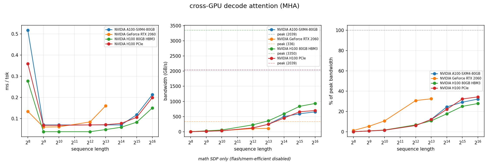

# Inference (in)efficiency

LLM inference is bottlenecked by the decode operation. I benchmarked decode attention across four GPUs. The gap between what these chips can do and what decode lets them do is the takeaway.

## KV Cache
Two things make decode expensive. First, the sizeable KV cache must be pinned in high bandwidth memory, where it must remain for the life of the request. Each new token attends to every previous token's keys and values. None of it can be evicted until the request is done.

Second, the decode operation itself is scattered. HBM is built for long contiguous reads, but decode does not use these. Consider decode attention: a row of Keys gets applied to current Query (small, single token), scores get softmaxed, then applied to a Values row, then all ops wait for a sync. Piecemeal, messy, stops and starts.

As a result, expensive memory ends up babysitting and GPU compute gets starved.

## Tool
I built a benchmark to measure directly. Decode attention from scratch, no optimizations, across four GPUs (RTX, A100, H100 PCIe, H100 SXM).

## Results
Charts shows token serve speed, bandwidth, and % of peak bandwidth utilized. On bandwidth charts, note that bandwidth grows over sequence length but then moderates/flattens. Even the H100 SXM (3.35 TB/s peak) sits below 30%. Scale to 50,000 GPUs, and the white space represents billions in underutilized compute.

FlashAttention and MQA already improve this. Future architectures promise KV cache offloading to DRAM and SSD (see [Deepseek Engram](https://gist.github.com/jnros/92ed1e5b5af05d3a2fd353b4537af744)). The entire optimization stack is trying to close this gap.

